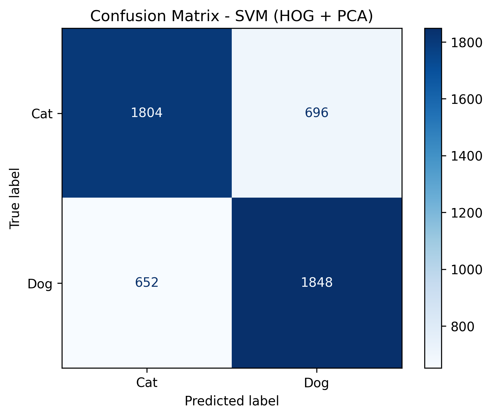
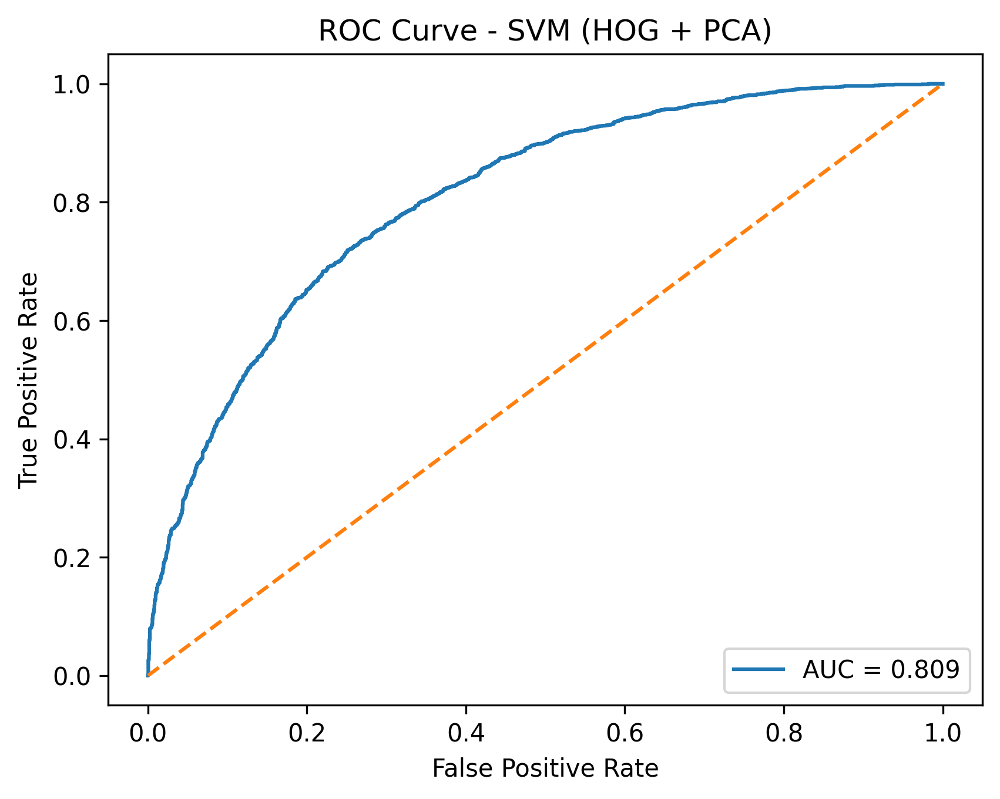
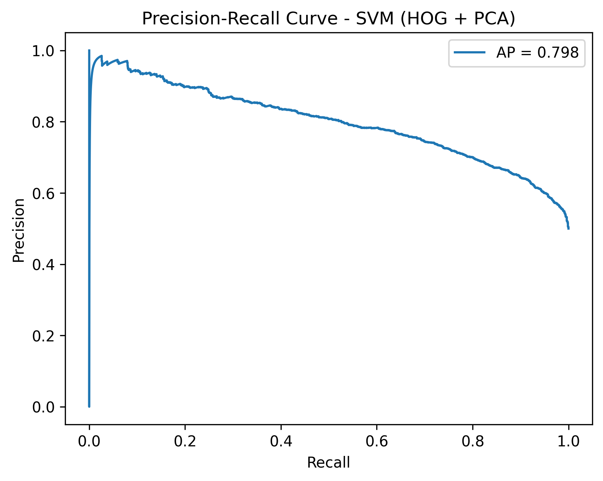

# Image Classification for Dogs and Cats using SVM

This project implements a classical machine learning approach to classify images of dogs and cats. Instead of using end-to-end deep learning models, the system relies on handcrafted feature extraction combined with dimensionality reduction and a Support Vector Machine (SVM) classifier. The focus of this project is on interpretability, efficiency, and strong performance using traditional computer vision techniques.

---


## Live Demo

The application is deployed and publicly accessible:

🔗 [Identify Dogs & Cats using AI](https://image-classification-svm-dog-cat.onrender.com/)

> Note: The free hosting service may take a few seconds to wake up.

---

## Table of Contents

- Introduction  
- Methodology  
- Dataset  
- Requirements  
- Project Structure  
- Usage  
- Results  
- Discussion  
- Time & Space Complexity  
- Future Scope  
- License  

---

## Introduction

Image classification is a core problem in computer vision. While deep learning models dominate this field, classical machine learning methods remain valuable due to their interpretability and lower computational requirements.

In this project, images are classified into **dog** and **cat** categories using a structured pipeline involving feature extraction, dimensionality reduction, and supervised classification. This approach demonstrates that well-engineered traditional methods can achieve competitive results without relying on deep neural networks.

---

## Methodology

### 1. Image Preprocessing
- Images are resized to a fixed resolution.
- Converted to grayscale to reduce dimensionality while preserving structural information.

### 2. Feature Extraction (HOG)
- Histogram of Oriented Gradients (HOG) is used to capture edge and texture information.
- HOG is well-suited for object and shape recognition tasks.

### 3. Feature Scaling
- Standardization is applied so that all features contribute equally to the classifier.

### 4. Dimensionality Reduction (PCA)
- Principal Component Analysis (PCA) reduces feature dimensionality.
- 95% of the original variance is retained, reducing noise and improving generalization.

### 5. Classification (SVM)
- A Support Vector Machine with an RBF kernel is trained.
- Hyperparameters are optimized using GridSearch with cross-validation.

---

## Dataset

The project uses the **Dogs vs Cats** dataset provided by Kaggle.  
The dataset contains labeled images of dogs and cats in JPEG format.

```text
train/
 ├── cat.0.jpg
 ├── dog.0.jpg
 ├── ...
```

---

## Requirements

- Python 3.7+
- numpy
- opencv-python
- scikit-image
- scikit-learn
- tqdm
- joblib

Install dependencies:

```bash
pip install -r requirements.txt
```

---

## Project Structure

```text
Image-Classification-SVM-Dog-Cat/
│
├── train_svm.py          # Model training with HOG + PCA + SVM
├── predict.py            # Prediction on new images
├── requirements.txt
├── models/
│   ├── svm_pca_dog_cat.pkl
│   ├── pca.pkl
│   └── scaler.pkl
├── sample_images/
│   ├── dog.jpg
│   └── cat.jpg
└── README.md
```

---

##  Usage

### Train the Model
```bash
python train_svm.py
```

### Predict on New Images
```bash
python predict.py
```

---

## Results

The proposed HOG + PCA + SVM pipeline achieves an overall classification accuracy of approximately **82–86%** on the test split of the Dogs vs Cats dataset.

Performance evaluation was conducted using multiple metrics including accuracy, confusion matrix, ROC curve, and Precision–Recall curve.

### Evaluation Visualizations

#### Confusion Matrix
The confusion matrix below shows the distribution of correct and incorrect predictions made by the SVM classifier on the test dataset.



#### ROC Curve
The ROC curve illustrates the trade-off between the true positive rate and false positive rate.



#### Precision–Recall Curve
The Precision–Recall curve highlights the balance between precision and recall.



---

## Web Application

A simple Flask-based web application is included to demonstrate real-time image classification.

### Features
- Upload an image
- Extract HOG features
- Apply PCA + SVM
- Display Dog / Cat prediction

### Run the Web App

```bash
cd webapp
python app.py
```

## Web Demo


---

## Discussion

The results demonstrate that classical machine learning techniques can be highly effective for image classification when combined with robust feature engineering. Histogram of Oriented Gradients (HOG) successfully captures edge and texture information critical for distinguishing between dogs and cats.

Applying Principal Component Analysis (PCA) significantly reduced feature dimensionality while preserving most of the informative variance. This improved computational efficiency and enhanced generalization by removing redundant and noisy features.

Although deep learning models may achieve higher accuracy, the proposed approach offers better interpretability, lower computational cost, and reduced dependency on specialized hardware.

---

##  Time Complexity Analysis

Let:
- **N** = number of images  
- **D** = number of extracted HOG features  
- **K** = number of principal components after PCA  

**HOG Feature Extraction:**  
- Time: **O(N × D)**

**PCA Transformation:**  
- Time: **O(N × D × K)** during fitting

**SVM Training:**  
- Time: Between **O(N²)** and **O(N³)** depending on kernel

**Inference:**  
- Time: **O(K)** per image

---

## Space Complexity Analysis

- HOG features: **O(N × D)**
- PCA features: **O(N × K)**
- SVM model (support vectors): **O(N)**
- PCA components: **O(D × K)**

PCA significantly reduces memory usage while maintaining performance.

---

## Future Scope

While the current implementation demonstrates strong performance using classical machine learning techniques, several enhancements can be explored:

1. Incorporating additional handcrafted features such as LBP or color histograms  
2. Hybrid feature learning using pretrained CNN features  
3. Extension to multi-class classification  
4. Advanced hyperparameter optimization techniques  
5. Real-time deployment in edge environments  
6. Data augmentation for improved robustness  
7. Improved model explainability and visualization  

---

## License

This project is licensed under the **MIT License**.


